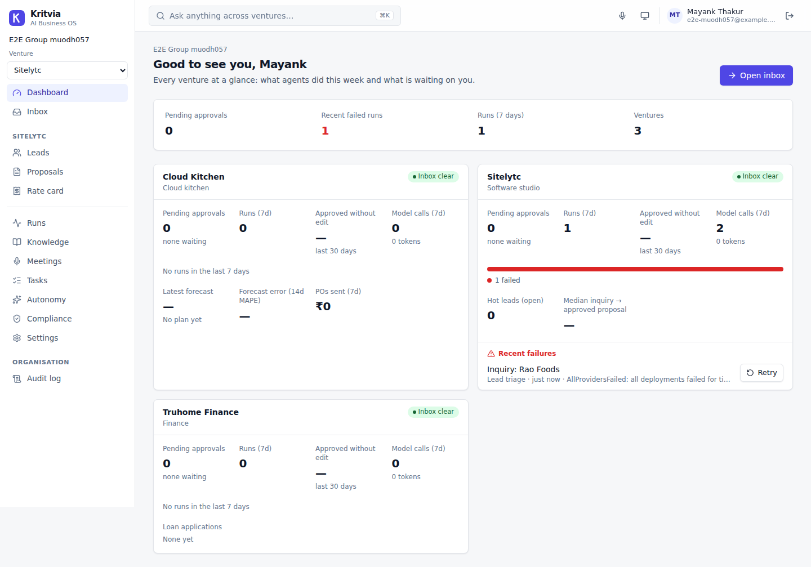
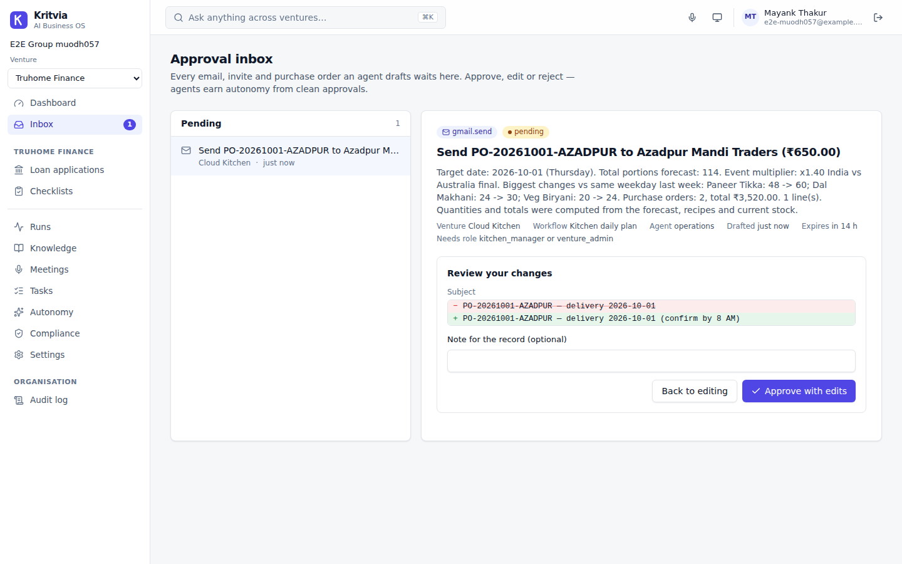
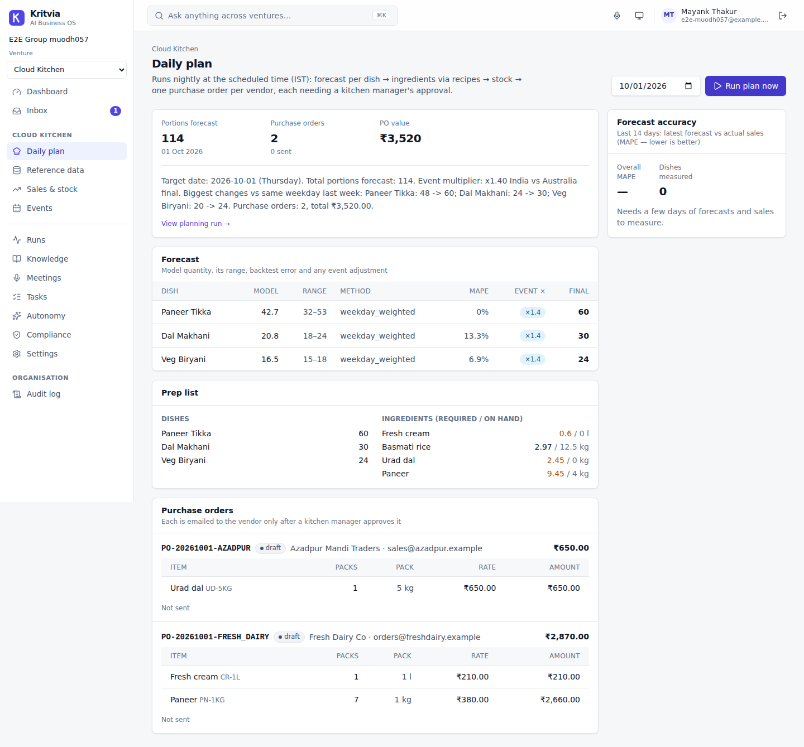
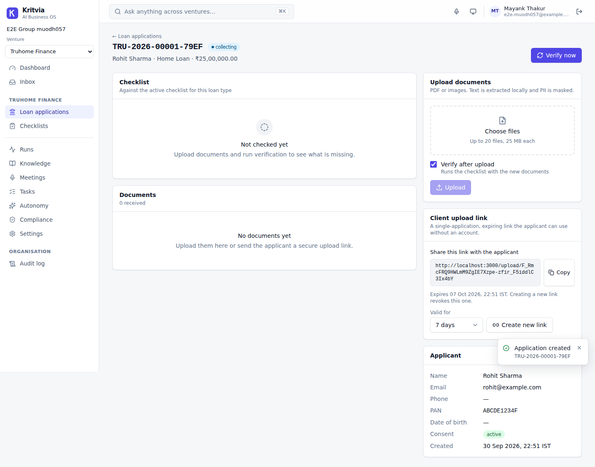
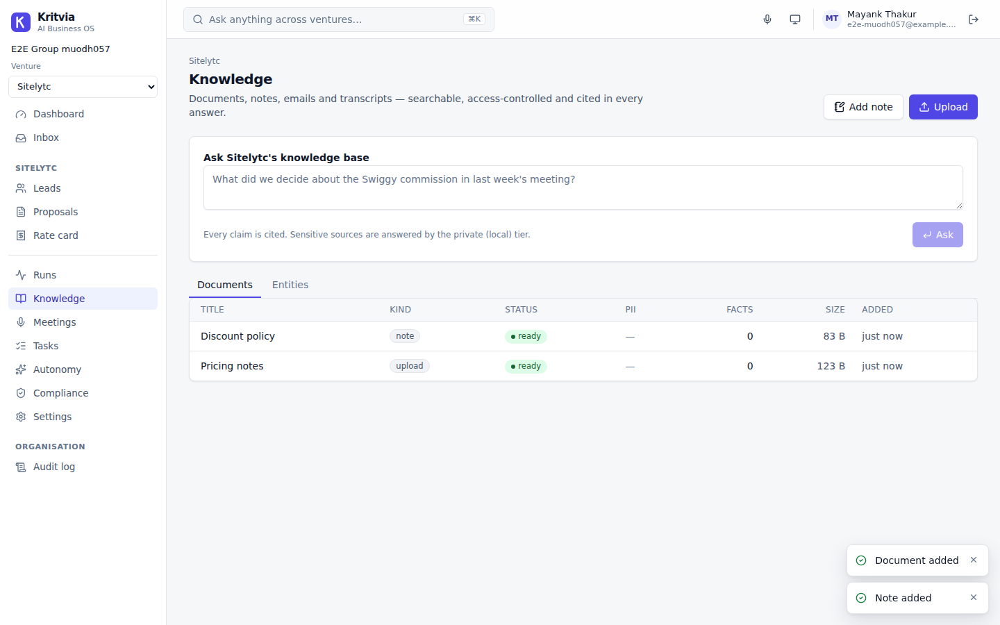
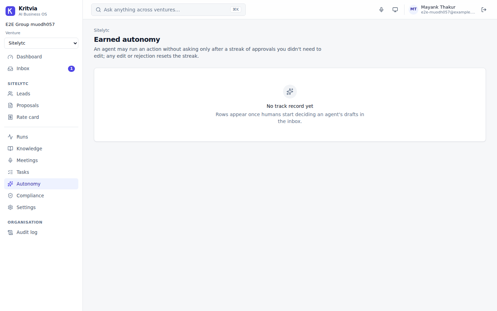
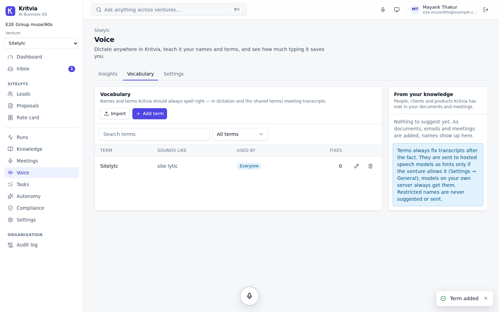
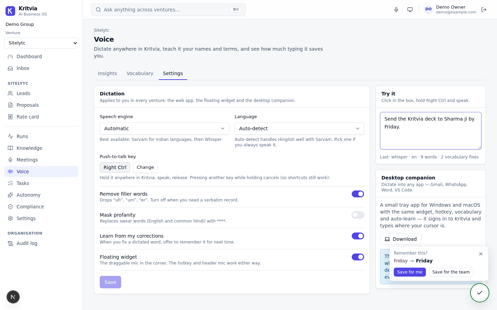

# Kritvia — AI Business Operating System

Multi-agent workflows that run your ventures in the background, with a human approving every
outbound action until agents earn trust. Built for Sitelytc Digital Media; dogfooded on
Sitelytc (software), Truhome Finance (loans) and a cloud kitchen before any client pilot.

**Status: MVP complete (Days 1–60 scope) + Voice, security-reviewed.** 107 backend tests (incl. exploit regressions) + 70 web unit tests + 16 end-to-end tests + 16 desktop tests.

```
apps/api            FastAPI: tenancy/RLS, auth, crypto, model router, workflow engine, all REST routes
  kritvia_api/engine      durable workflows: steps, checkpoints, approval interrupts, leases, policy engine
  kritvia_api/workflows   lead_triage · loan_verification · kitchen_daily · meeting_digest
  kritvia_api/services    memory (ingest → PII mask → chunks → embeddings → graph → cited Q&A), google,
                          messaging, pollers, sandbox client, OCR/text extraction
  kritvia_api/routers/voice.py  dictation, vocabulary, auto-learn, insights   (services/speech.py: cleanup + hints)
  migrations              forward-only SQL (0001 foundation … 0006 security hardening, 0007 voice)
apps/worker         arq worker: run execution, 23:30 schedules, sweeper, Gmail polling, retention, morning check
apps/web            Next.js 15 command center (BFF auth, approval inbox with diffs, venture views, voice widget)
apps/desktop        Kritvia Voice: Electron tray app — hold a key in any app, speak, text appears (own npm lockfile)
services/sandbox    gVisor job runner + allow-listed jobs (forecast, BOM)
services/diarization optional pyannote sidecar
packages/shared-types  OpenAPI schema + generated TypeScript types (CI fails if stale)
infra               docker-compose (same file for VM and VPC), LiteLLM + tier config, Postgres roles, scripts
docs                architecture, decisions (ADRs), runbook
```

## How the pieces fit

* **Isolation in the database.** The API and worker connect as `kritvia_app` (no BYPASSRLS, owns nothing). Every tenant table has `org_id`/`venture_id`, forced RLS and an audit trigger; role-restricted data (loan files) has RESTRICTIVE policies. Cross-venture access exists only as explicit, audited grants. A route sweep test attacks every endpoint with foreign ids.
* **Agents are service accounts.** Each venture has an `agent_runtime` account; runs execute as it, so RLS bounds every agent to one venture, and it can never approve.
* **Approvals are interrupts.** A step returns `Interrupt(ApprovalRequest)`; the run is checkpointed (state encrypted) and parked. `decide_approval()` checks the decider's role, updates earned-autonomy counters and re-queues the run atomically. Tools execute the *approved* payload, at most once.
* **Earned autonomy.** After N consecutive unedited approvals (default 30, per venture) an admin may promote an (agent, action) to auto-run; promotions and demotions are audited; sensitive drafts are never auto-approved.
* **Models are configuration.** Workflows ask for a tier (`fast`, `extract`, `reason`, `private`, `embed`, `speech`, `long_context`); `infra/litellm/tiers.yaml` maps tiers to fallback chains; sensitive requests can only reach local/BYOK deployments. Every attempt is metered (metadata only).
* **LLMs reason, code calculates.** Rate-card pricing, forecasts, BOM/pack rounding, PO totals and checklist rules are deterministic code (the numeric jobs run in the sandbox).
* **Every answer cites its source.** Facts carry a mandatory `source_chunk_id`; answers cite numbered sources and are flagged when unsupported.
* **Voice everywhere, spelled your way.** Hold a key (or click the floating widget) to dictate into any field — or, with the desktop companion, into any app. Sarvam handles Hindi/Hinglish and 22 Indian languages, Whisper the rest, a local model the private work. Your vocabulary fixes names after transcription and (if the venture allows) biases the model; correcting a word offers to remember it. Cleanup filters, insights and meeting transcripts use the same pipeline. Ported pieces from [AIT-Scribe](https://github.com/aithinkers/scribe) (MIT) — see `THIRD_PARTY_NOTICES.md`.
* **Tamper-evident audit log.** Per-org SHA-256 hash chain, append-only, verifiable from the UI and CLI.

## Run the tests

```bash
# Postgres 16 + pgvector on localhost as postgres/postgres
cd apps/api && pip install -e ".[dev]" && pytest -q
pnpm install && pnpm --filter @kritvia/web lint && pnpm --filter @kritvia/web typecheck \
  && pnpm --filter @kritvia/web test && pnpm --filter @kritvia/web build
```

## Try it in your browser (GitHub Codespaces)

[](https://codespaces.new/smayankthakur/Kritvia-Global-Dashboard?quickstart=1)

The dev container starts Postgres + pgvector, installs everything, seeds a demo workspace
(three ventures, rate card, loan checklist, 8 weeks of kitchen sales) and runs tomorrow's
kitchen plan so the inbox has real purchase orders to approve. The dashboard opens on port 3000.
Sign in with `demo@example.com` / `kritvia-demo-2026`. Restart later with `bash scripts/dev-up.sh`.
Model-driven steps (lead triage, loan checks) need a model gateway — see the runbook.

## Run it

See **[docs/runbook.md](docs/runbook.md)**. In short:

```bash
cp .env.example .env            # fill secrets; back up MASTER_KEK_B64 offline
cd infra && docker compose build sandbox-jobs && docker compose --profile tunnel up -d
docker compose exec ollama ollama pull qwen2.5:7b-instruct && docker compose exec ollama ollama pull bge-m3
docker compose exec api python -m kritvia_api.cli bootstrap --email you@sitelytc.com --name "Your Name"
```

Local development without Docker: API `uvicorn kritvia_api.main:app` with `DISPATCH_MODE=background`
(runs execute in-process), web `pnpm --filter @kritvia/web dev` with `KRITVIA_API_URL=http://localhost:8000`.

## Exit criteria → proof

| Criterion | Proven by |
|---|---|
| Venture A cannot read Venture B through any API route | `tests/test_isolation.py` (behavioural + automatic sweep of all routes + raw-SQL checks as the app role) |
| Every write appears in the audit log; the log is tamper-evident | `tests/test_audit.py` |
| A model call routes by tier and falls back on rate limit; sensitive data stays local | `tests/test_model_router.py`, `test_loan_verification.py` |
| A workflow pauses at an interrupt, survives a restart, resumes on approval | `tests/test_engine.py`, `tests/test_lead_triage.py` |
| Sandboxed code cannot reach the network | sandbox `/healthz` probe, CI `images` job, `tests/test_sandbox.py` (Docker) |
| "What did we propose to client X?" answers with working source links | `tests/test_memory.py` |
| Voice notes and meetings transcribe; decisions/tasks cite timestamps | `tests/test_memory.py` |
| Dictation uses your vocabulary and engine; hints never leak restricted, sensitive or (by default) any names to hosted models | `tests/test_voice.py`, `apps/desktop/tests` |
| Three dogfood workflows run end to end with approvals | `test_lead_triage.py`, `test_loan_verification.py`, `test_kitchen.py`, worker schedule tests in `test_ops.py` |
| 10 consecutive days on real data | operational — dashboard tracks runs, failures, approval/edit rates, MAPE |

## Screens

| Executive dashboard | Approval inbox — edit with diff |
|---|---|
|  |  |
| **Kitchen daily plan** | **Loan application checklist** |
|  |  |
| **Knowledge with cited answers** | **Earned autonomy** |
|  |  |
| **Voice vocabulary** | **Dictation widget — auto-learn** |
|  |  |

(Regenerated by `pnpm --filter @kritvia/web e2e` into `apps/web/e2e/screenshots/`.)
