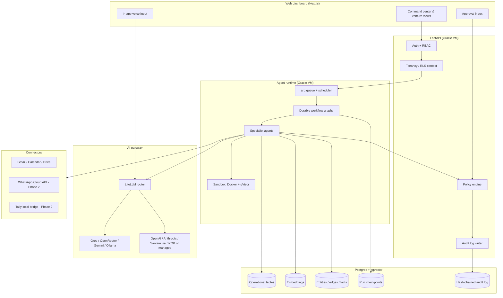
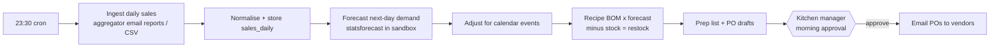

# Kritvia — AI Business Operating System

## Architecture, Zero-Cost Stack, 60-Day MVP Plan & Dogfood Workflows

**Owner:** Mayank Thakur, Sitelytc Digital Media Pvt. Ltd. **Version:** 1.0 · September 2026 **Status:** Approved direction — built (see [as-built notes](decisions.md))

---

## 1. Executive summary

Kritvia merges two product ideas into one platform: the **multi-agent workforce and sandboxed execution** of the original Kritvia AIBOS, and the **voice, meeting, memory and permissioned-action layers** pioneered by tools like AIT Scribe. It is sold as a white-glove, deployed platform (PaaS) to multi-venture founders and high-ticket enterprise clients, after first being proven inside Sitelytc's own ventures.

The core job at launch is **multi-agent orchestration**: executing complex, multi-step business workflows in the background, with humans approving every outbound action until agents have earned trust.

**The MVP goal (60 days):** a working orchestration engine, built on enterprise-grade security foundations, running three real workflows daily across Sitelytc (software), Truhome Finance (real estate & finance) and the cloud kitchen.

**Cost target:** zero cost to build and dogfood. Small, predictable costs begin only when external clients pilot (app verification, messaging fees, signing, frontier-model usage via BYOK or the managed tier).

---

## 2. Design principles

1. **Security is foundation, not feature.** Tenancy, RLS, encryption and audit logging are built in weeks 1–2. They are nearly impossible to retrofit.
2. **Humans approve, agents earn autonomy.** Every write or send is a draft by default. Autonomy is granted per agent, per action, based on approval history.
3. **Every answer cites its source.** Any fact the system states links back to the document, email, transcript or record it came from.
4. **Models are configuration, not code.** Workflows request a *capability tier*; config maps tiers to models. Swapping models never requires a deploy.
5. **LLMs reason; code calculates.** Prices, forecasts, quantities and totals come from deterministic code or statistical models. LLMs extract, classify, plan and write — they never do the arithmetic.
6. **Same stack everywhere.** What runs on the Oracle VM is what ships to an enterprise VPC. Docker Compose from day one.
7. **Dogfood before selling.** Nothing goes to a client pilot until it has run on Sitelytc's own ventures.

---

## 3. Zero-cost stack

| Layer | Choice | Free-tier notes |
| --- | --- | --- |
| Frontend | Next.js (v0 SaaS UI as foundation) on **Vercel Hobby** | Hobby is non-commercial — fine for internal dogfooding, move to self-host on the VM or a paid plan before client pilots |
| Backend API | **FastAPI** on **Oracle Cloud Always Free ARM VM** | Always-on; no sleep on idle |
| Agent runtime | **LangGraph** workers on the same VM | Durable checkpoints in Postgres |
| Job queue & scheduler | **arq + Valkey** (Redis-compatible, self-hosted) on the VM | Alternative: Procrastinate (Postgres-only) to drop Valkey |
| Database | **Supabase** Postgres + pgvector (or Postgres on the VM) | Supabase free projects pause when idle and cap storage; a Postgres container on the VM avoids both |
| Auth | Supabase Auth (or Auth.js if Postgres moves to the VM) |  |
| AI gateway | **LiteLLM** (open source, self-hosted) | One interface to OpenAI, Anthropic, Gemini, Groq, OpenRouter, Ollama, Sarvam and more |
| Free inference | Groq free tier, OpenRouter free models, Gemini free tier, **Ollama** on the VM | Rate-limited; never send client data through free tiers whose terms allow training on inputs |
| Embeddings | **bge-m3** via Ollama | Multilingual — handles Hindi and Hinglish |
| Speech-to-text | **faster-whisper** on the VM; Groq-hosted Whisper; Sarvam for Hindi-heavy audio |  |
| Speaker separation | **pyannote** (open source) | Requires a free Hugging Face token and model-license acceptance |
| OCR | **PaddleOCR** / Tesseract | PaddleOCR handles Indian ID and financial documents better |
| Forecasting | **statsforecast** / Prophet | Deterministic numeric forecasts |
| Sandbox | Docker + **gVisor** on the VM | Existing three-layer defense-in-depth design |
| Monorepo | pnpm + Turborepo |  |
| Packaging | Docker Compose (Helm in Phase 2) | Same artefact for VPC / on-prem |

> Verify each provider's current free-tier terms before relying on them. They change often.

### Costs that appear before the enterprise pilot

- Google OAuth app verification (and a paid security assessment for restricted Gmail scopes) once external users connect Gmail. Internal "testing" mode avoids this during dogfooding.
- WhatsApp Cloud API charges for business-initiated template messages.
- Frontier-model usage (via client BYOK or Sitelytc's managed tier).
- A domain and TLS are effectively free (Cloudflare), but a commercial Vercel plan or self-hosting is required for client-facing use.

---

## 4. System architecture

### 4.1 Tenancy and identity

- Hierarchy: **Organisation → Venture → Users**. Each business (Sitelytc, Truhome Finance, the cloud kitchen) is a Venture with a hard data boundary.
- Every tenant-owned table carries `org_id` and `venture_id`, enforced with **Postgres Row-Level Security**. The API sets the tenant context per request; application code is not the only line of defense.
- Executive cross-venture views work through **explicit grants** evaluated by RLS policies — never by a bypass role in application code.
- RBAC roles are scoped per venture: e.g. `org_owner`, `venture_admin`, `operator`, `approver`, `viewer`, plus workflow-specific roles like `kitchen_manager` and `loan_officer`.

### 4.2 AI gateway and routing

LiteLLM sits behind a thin Kritvia routing layer. Workflows request a **capability tier**, never a model name.

| Tier | Used for | Default (free, MVP) | Upgrade path (BYOK / managed) |
| --- | --- | --- | --- |
| `fast` | Classification, triage, short summaries | Groq-hosted open model | Same |
| `extract` | Structured JSON extraction from text | Groq / local Ollama model | Frontier small model |
| `reason` | Agent planning, proposal drafting, multi-step decisions | Best available free open model | Frontier reasoning model |
| `long_context` | Whole-document or multi-document analysis | Gemini free tier — **internal, non-sensitive data only** | Gemini paid / frontier long-context |
| `private` | Anything touching sensitive personal or financial data | **Local Ollama only** | Client's own BYOK in their VPC |
| `speech` | Transcription | faster-whisper / Groq Whisper | Sarvam for Hindi/Hinglish |
| `embed` | Vector embeddings | bge-m3 via Ollama | Same |

The router also handles fallback chains (when a free tier returns a rate-limit error, try the next provider in the tier), per-tenant encrypted BYOK keys, and usage metering per tenant, workflow and tier (needed for managed billing).

The `private` tier is a hard rule, not a preference: the policy engine rejects routing a request tagged as sensitive to any provider outside the allowed list for that tenant.

### 4.3 Orchestration engine

- Durable workflow graphs with Postgres checkpoints. Workflows survive restarts and can pause for hours or days waiting on approval.
- **arq** schedules cron triggers and consumes event triggers (new email, file upload, webhook).
- The existing 15-agent workforce is reorganised into **specialist agents**: each has a declared toolset, a default model tier and a permission profile. Lead scoring, forecasting, outreach and marketing become agents within this workforce; the standalone lead-gen and marketing tools fold in here.
- **Approvals are interrupts.** The workflow checkpoints, creates an approval item, and resumes only when an authorised user approves, edits or rejects.

### 4.4 Action and permission layer

Every tool declares one capability class:

| Class | Examples | Default policy |
| --- | --- | --- |
| `read` | Search Gmail, read Drive file, query knowledge graph | Runs silently, logged |
| `write` | Create calendar draft, update CRM record, save document | Drafted → approval inbox |
| `send` | Send email, dispatch PO, send WhatsApp message | Drafted → approval inbox; auto-run disabled until explicitly promoted |
| `execute` | Run code in sandbox | Runs inside sandbox only, resource-limited, logged |

**Earned autonomy:** each `(agent, action, venture)` tuple keeps an approval record (approved unchanged / edited / rejected). An admin can promote a tuple to auto-run once it meets a threshold (e.g. 30 consecutive approvals with no edits). Promotion and demotion are themselves audited.

### 4.5 Knowledge graph and memory

**Ingestion pipeline:** source (email, Drive file, upload, transcript, chat) → text extraction / OCR → PII tagging → chunking → embeddings (bge-m3) → pgvector.

**Extraction pass:** an `extract`-tier agent writes structured knowledge:

- `entities` — people, companies, projects, properties, vendors, SKUs, loans
- `edges` — typed relationships (`OWNS`, `CLIENT_OF`, `SUPPLIES`, `BLOCKED_BY`, `APPLIED_FOR`)
- `facts` — atomic statements with a mandatory `source_chunk_id`

Every fact and every answer carries a pointer to its source, so the UI can always show "this came from here." Retrieval combines vector similarity, graph traversal and tenant filtering.

### 4.6 Voice and meetings (MVP scope)

- **In-app voice:** browser recording → `speech` tier → text inserted into the active field or sent as a command to an agent.
- **Meetings:** uploaded recording → transcription → pyannote speaker separation → extraction of decisions, owners and tasks → knowledge graph, with each item cited to a timestamp.
- Deferred to later: system-wide dictation, live meeting bots, voice interviews that fill knowledge gaps.

### 4.7 Sandbox

The three-layer defense-in-depth sandbox runs on the VM using Docker with the gVisor runtime: no network by default, CPU/memory/time limits, read-only base image, ephemeral filesystem, and only explicitly mounted inputs. Used for data analysis (forecasting, spreadsheet processing) and for generating structured outputs like POs.

### 4.8 Security and DPDP compliance

- **Envelope encryption:** each tenant has a data-encryption key (DEK) that encrypts sensitive columns and stored files. DEKs are wrapped by a master key — held on the VM for dogfooding, moved to the client's KMS for VPC deployments.
- **Immutable audit log:** append-only table where each row stores the hash of the previous row, making tampering detectable. Logs every read of sensitive data, every agent action, every approval, every permission change and every model call (metadata only, not content).
- **DPDP Act foundations:** consent records with purpose, data-principal requests (access, correction, erasure) as tracked workflows, retention policies per data class, and a breach register.
- **Sensitive identifiers:** Aadhaar and similar numbers are masked on ingestion (store only what the business process requires); raw documents are encrypted and access-logged.

---

## 5. Core data model (essentials)

| Table | Purpose |
| --- | --- |
| `organisations`, `ventures`, `memberships`, `roles`, `grants` | Tenancy and RBAC |
| `connectors`, `connector_tokens` (encrypted) | Per-venture OAuth and API credentials |
| `documents`, `chunks` (embedding column) | Ingested content and vectors |
| `entities`, `edges`, `facts` | Knowledge graph with source citations |
| `workflow_configs`, `workflow_runs`, `workflow_steps`, `trigger_events` | Orchestration state and checkpoints |
| `approvals` | Inbox items: draft payload, approver, decision, edits |
| `agent_trust` | Approval history per (agent, action, venture) |
| `model_calls` | Usage metering (tier, provider, tokens, latency, cost) |
| `audit_log` | Hash-chained, append-only |
| `consents`, `dpdp_requests`, `retention_policies`, `breach_register` | Compliance |
| Venture-specific: `leads`, `rate_cards`, `proposals`, `loan_applications`, `document_checklists`, `loan_documents`, `sales_daily`, `dishes`, `ingredients`, `recipe_items`, `vendors`, `vendor_items`, `stock_counts`, `calendar_events`, `forecasts`, `purchase_orders`, `prep_lists` | Workflow data |

---

## 6. Dogfood workflows (Days 46–60)

### 6.1 Sitelytc — Inbound Lead Triage & Proposal Drafting

**Stresses:** email connector, knowledge-graph retrieval, multi-model routing. **Trigger:** new inquiry in the Sitelytc Gmail inbox (polled) or a signed lead-form webhook.

Guardrails: prices come from the rate card plus matched historical bids (the LLM never invents them, and stray currency amounts in its text are rejected); the proposal shows which past projects and templates it drew on; the same sender or company within a window updates the existing lead.

**Success metrics:** time from inquiry to approved proposal; approval rate without edits; proportion of proposal text reused from verified templates.

### 6.2 Truhome Finance — Loan Document Verification

**Stresses:** document ingestion, OCR and structured extraction, compliance rule-checking, sensitive-data handling. **Trigger:** client emails documents (subject carries the application reference) or uploads them through a document request link.

```mermaid
flowchart LR
    A[Documents received] --> B[OCR + text extraction<br/>local]
    B --> C[Classify doc type<br/>tier: private]
    C --> D[Extract fields<br/>tier: private]
    D --> E[Mask sensitive IDs<br/>encrypt originals]
    E --> F[Checklist + rule engine<br/>deterministic]
    F --> G[Cross-document consistency<br/>name, DOB, address, PAN]
    G --> H[Draft follow-up of missing items<br/>tier: private]
    H --> I{{Loan officer review}}
    I -- approve --> J[Send email to client]
```

Guardrails: all model calls use the `private` tier (local only); checklists and pass/fail rules are Truhome configuration; raw documents are restricted to `loan_officer` and every view is audit-logged; consent and retention are enforced from the first run. **Confirm with Truhome's compliance advisor which lending regulations and partner-lender requirements apply before the workflow handles live applications.**

**Success metrics:** extraction accuracy on a hand-checked sample; percentage of missing-document cases caught; turnaround from upload to follow-up email.

### 6.3 Cloud Kitchen — Daily Demand Forecasting & PO Generation

**Stresses:** scheduled background jobs, data analysis in the sandbox, predictive output, role-based approval. **Trigger:** cron at **23:30 IST** daily.

Guardrails: forecast numbers, quantities and PO totals are computed by code; requires recipe BOMs, a vendor list with SKUs and prices, and stock levels; fallback chains keep the overnight run alive and a 06:30 check alerts if it failed; the kitchen can upload a CSV when reports don't arrive by email; check the licence of any weather API before adding it.

**Success metrics:** forecast error (MAPE) per dish over two weeks; wastage and stock-out incidents versus the previous manual process; time the manager spends approving each morning.

---

## 7. 60-day MVP plan and exit criteria

| Phase | Exit criteria | Proven by |
| --- | --- | --- |
| Days 1–14 Foundation | Venture A cannot read Venture B through any API route; every write is audited; a model call routes by tier and falls back on rate limit | `test_isolation.py` (incl. an automatic sweep of every route), `test_audit.py`, `test_model_router.py` |
| Days 15–30 Orchestration | A workflow pauses at an interrupt, survives a restart and resumes on approval; sandboxed code cannot reach the network | `test_engine.py`, `test_lead_triage.py`, `test_sandbox.py` + CI `images` job, sandbox `/healthz` |
| Days 31–45 Memory | "What did we propose to client X?" returns an answer with working source links; a Hindi/Hinglish voice note transcribes | `test_memory.py` |
| Days 46–60 Dogfood | Each workflow runs on real data for 10 consecutive days; failures visible and recoverable; approval and edit rates tracked | `test_lead_triage.py`, `test_loan_verification.py`, `test_kitchen.py`, dashboard metrics, morning check — then 10 days of live use |

## 8. Phase 2 — toward the early-2027 enterprise pilot

WhatsApp Cloud API connector · Tally local bridge · Slack and Jira connectors · BYOK management UI and managed billing tier · Helm charts and VPC deployment guide; master key moved to client KMS · complete DPDP workflows (correction, nomination) · Google OAuth verification · production frontend hosting · optional live meeting bot, desktop app, voice interviews.

## 9. Risks and mitigations

| Risk | Impact | Mitigation |
| --- | --- | --- |
| Free-tier rate limits during nightly or bursty runs | Workflows fail or run late | Fallback chains per tier; local Ollama as last resort; morning check alert |
| Free-tier provider terms allow training on inputs | Data exposure | `private` tier enforced in code for sensitive requests |
| Oracle Always Free capacity or account limits | Downtime | Nightly encrypted backups off-VM with a restore drill; Compose stack reproducible on any VM |
| LLM hallucinating prices, quantities or document status | Wrong proposals, POs or loan decisions | Deterministic code for all numbers and rules; human approval on all sends |
| RLS misconfiguration | Cross-venture data leak | Isolation test suite in CI; no bypass roles in app code |
| Solo build scope creep | Missed target | Phase 2 list is the parking lot; exit criteria gate each phase |

## 10. Open decisions (defaults taken — see decisions.md)

1. Postgres on the VM (taken). 2. arq + Valkey (taken). 3. Sitelytc rate card and proposal templates — **owner to enter**. 4. Truhome checklists per loan type and the `loan_officer` holders — **owner / compliance advisor to confirm** (a starting template ships). 5. Recipe BOMs, vendor list and stock method — **kitchen to enter** (CSV templates ship). 6. Trust-promotion threshold — default 30, configurable per venture.
